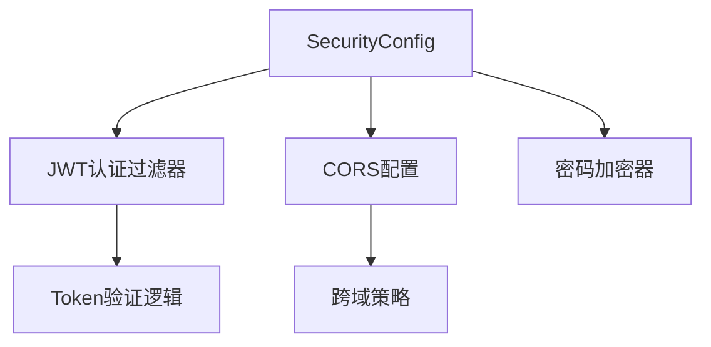
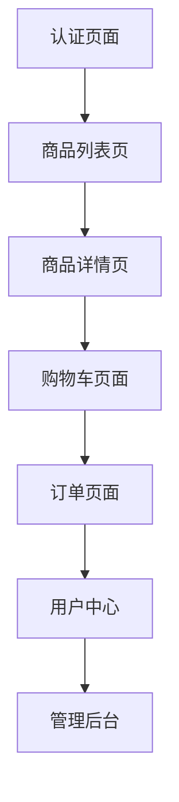
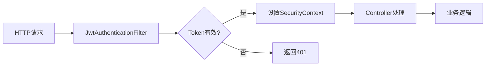
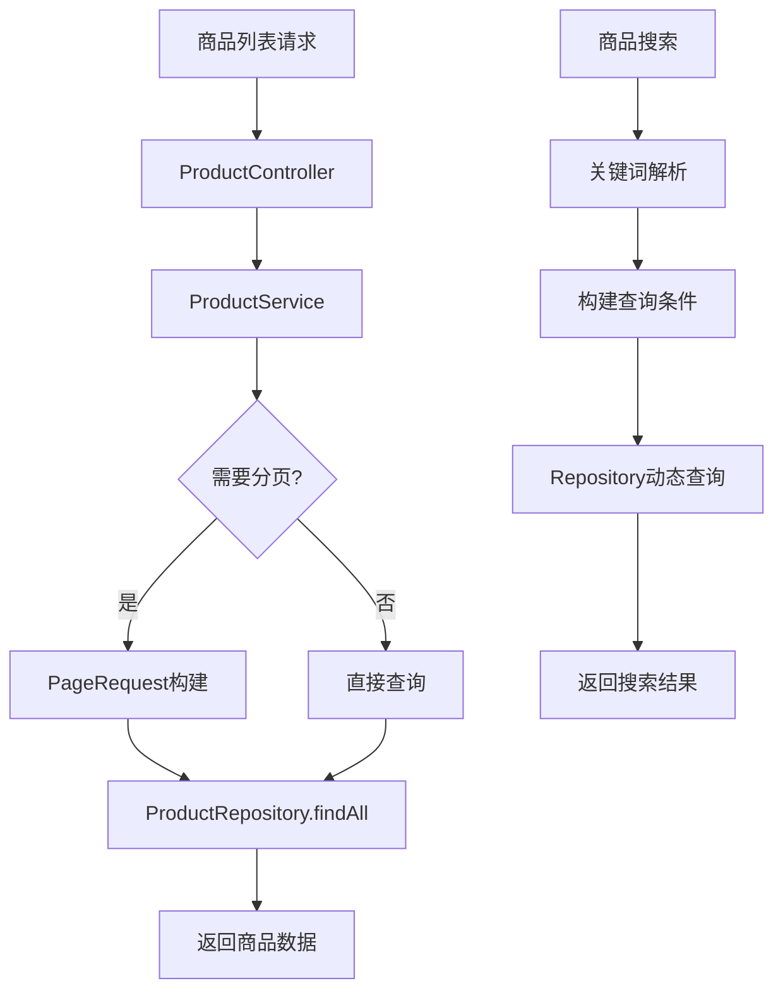
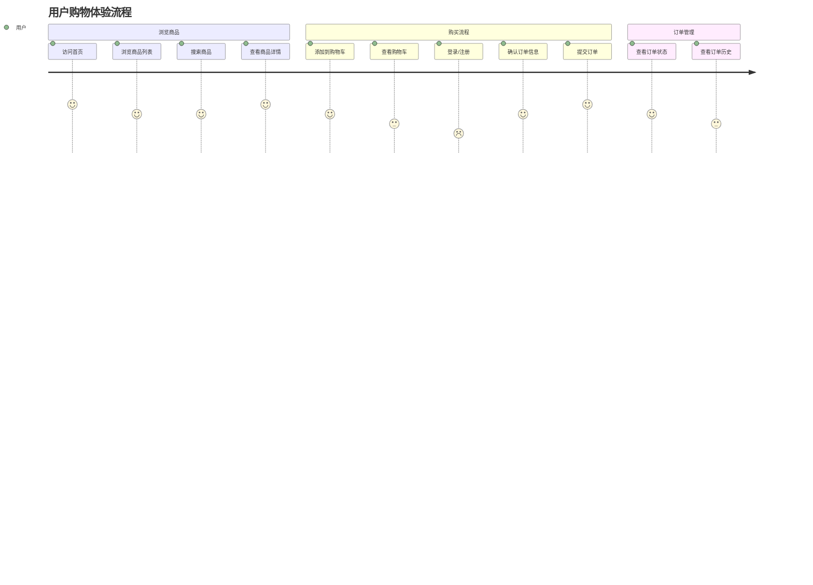
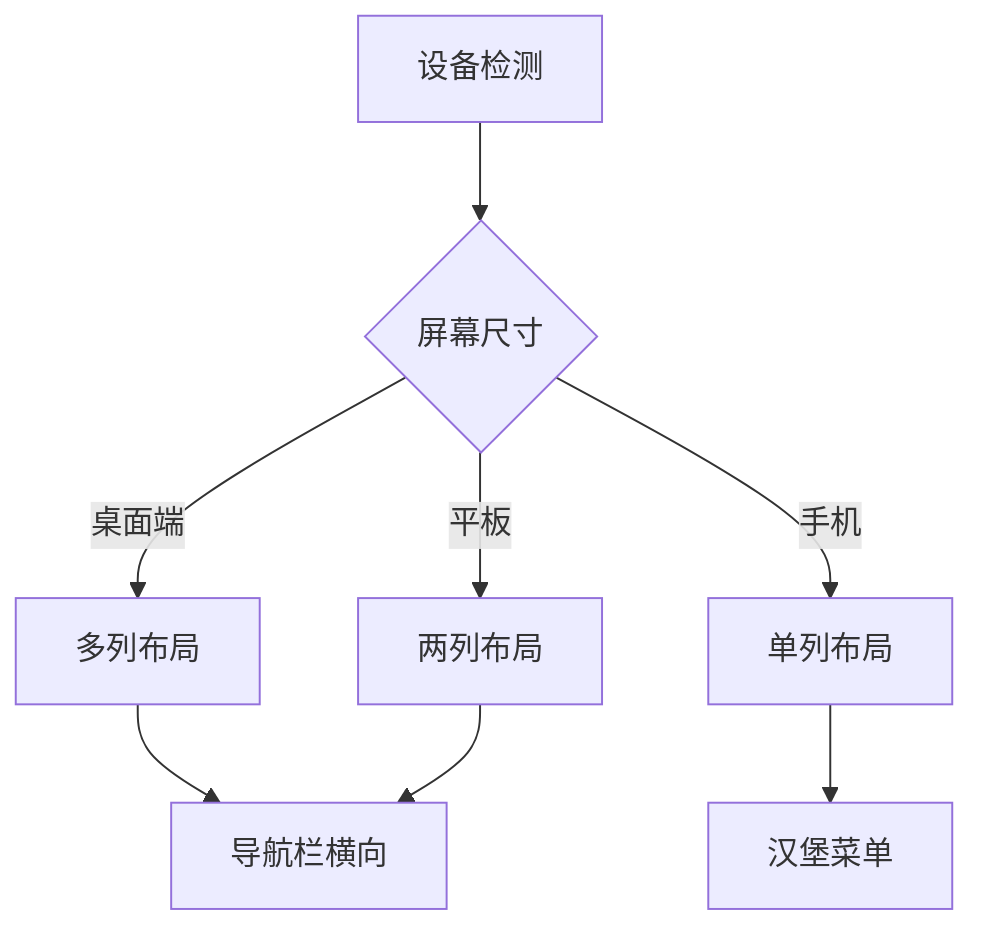
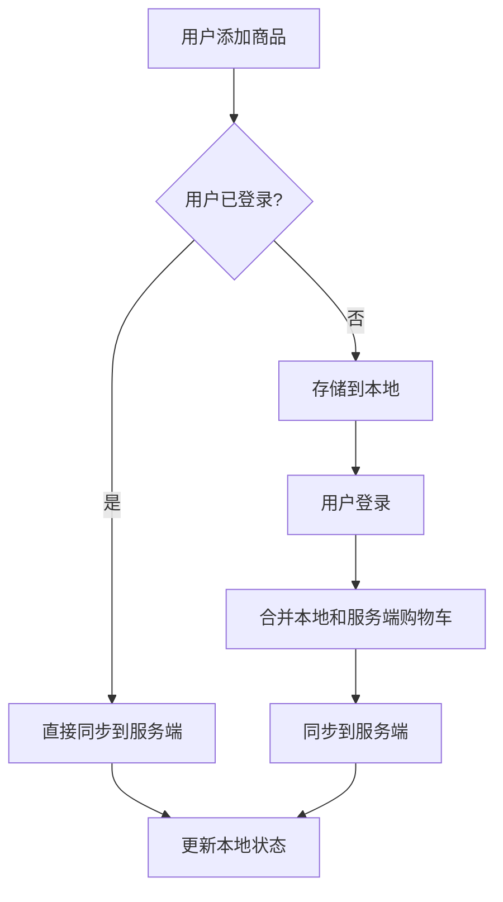

# FullStackMall 继续开发设计文档

## 1. 项目当前状态分析

### 1.1 已完成组件
✅ **后端核心架构**
- Spring Boot 主启动类已创建
- 完整的实体层（User, Product, Cart, CartItem, Order, OrderItem）
- 完整的Repository层（JPA接口）
- 完整的Service层（业务逻辑）
- 部分Controller层（AuthController）
- 完整的DTO层（数据传输对象）

✅ **项目配置**
- Maven配置文件（pom.xml）
- 应用配置文件（application.yml）
- Docker部署配置（docker-compose.yml）

### 1.2 待实现组件
❌ **前端React应用** - 完全缺失
❌ **后端配置层** - Security和Web配置
❌ **完整的Controller层** - 缺少Product、Cart、Order控制器
❌ **数据库初始化** - 测试数据和Schema
❌ **前后端集成测试**

## 2. 继续开发优先级

### 2.1 第一阶段：完善后端API层
优先级：🔥 高优先级

#### 2.1.1 安全配置实现


**需要实现的配置类：**
- `SecurityConfig.java` - Spring Security主配置
- `JwtAuthenticationFilter.java` - JWT认证过滤器
- `WebConfig.java` - Web相关配置（CORS等）

#### 2.1.2 Controller层补全
**需要实现的控制器：**

| 控制器 | 功能 | 优先级 | API端点数量 |
|--------|------|--------|-------------|
| ProductController | 商品管理API | 高 | 5个 |
| CartController | 购物车API | 高 | 4个 |
| OrderController | 订单管理API | 中 | 3个 |
| AdminController | 管理后台API | 低 | 3个 |

**ProductController API设计：**
```
GET    /api/products           # 商品列表（分页、搜索、分类筛选）
GET    /api/products/{id}      # 商品详情
POST   /api/products           # 创建商品（管理员）
PUT    /api/products/{id}      # 更新商品（管理员）
DELETE /api/products/{id}      # 删除商品（管理员）
```

### 2.2 第二阶段：前端React应用开发
优先级：🔥 高优先级

#### 2.2.1 前端项目初始化
**技术栈选择：**
- React 18 + TypeScript
- Vite（构建工具）
- Tailwind CSS（样式框架）
- React Router（路由管理）
- Axios（HTTP客户端）
- Zustand（状态管理）

#### 2.2.2 前端目录结构设计
```
frontend/
├── public/
├── src/
│   ├── components/          # 通用组件
│   │   ├── ui/             # 基础UI组件
│   │   ├── layout/         # 布局组件
│   │   └── features/       # 功能组件
│   ├── pages/              # 页面组件
│   │   ├── Home/
│   │   ├── Products/
│   │   ├── Cart/
│   │   ├── Auth/
│   │   └── Admin/
│   ├── services/           # API服务
│   ├── stores/             # 状态管理
│   ├── utils/              # 工具函数
│   ├── types/              # TypeScript类型
│   └── hooks/              # 自定义Hook
├── package.json
├── vite.config.ts
└── tailwind.config.js
```

#### 2.2.3 核心页面开发优先级


**页面开发顺序：**
1. **认证页面** (Login/Register) - 用户登录注册
2. **首页和商品列表** - 商品展示和搜索
3. **商品详情页** - 商品信息展示和加购物车
4. **购物车页面** - 购物车管理
5. **订单流程** - 下单和订单管理
6. **管理后台** - 商品和订单管理

### 2.3 第三阶段：数据库和测试
优先级：🟡 中优先级

#### 2.3.1 数据库初始化
**需要创建：**
- 数据库Schema脚本
- 测试数据插入脚本
- 数据库迁移脚本

#### 2.3.2 测试实现
**后端测试：**
- Controller集成测试
- Service单元测试
- Repository数据访问测试

**前端测试：**
- 组件单元测试（Jest + React Testing Library）
- E2E测试（Playwright）

## 3. 详细实现规划

### 3.1 后端API补全实现

#### 3.1.1 安全配置架构


#### 3.1.2 商品管理功能流程


### 3.2 前端状态管理设计

#### 3.2.1 Zustand Store结构
```javascript
// 认证状态
interface AuthStore {
  user: User | null;
  token: string | null;
  isAuthenticated: boolean;
  login: (credentials) => Promise<void>;
  logout: () => void;
  register: (userData) => Promise<void>;
}

// 商品状态
interface ProductStore {
  products: Product[];
  currentProduct: Product | null;
  loading: boolean;
  fetchProducts: (params) => Promise<void>;
  fetchProduct: (id) => Promise<void>;
  searchProducts: (query) => Promise<void>;
}

// 购物车状态
interface CartStore {
  items: CartItem[];
  totalPrice: number;
  addItem: (productId, quantity) => Promise<void>;
  updateItem: (itemId, quantity) => Promise<void>;
  removeItem: (itemId) => Promise<void>;
  clearCart: () => void;
}
```

#### 3.2.2 API服务层设计
```javascript
// API基础配置
class ApiClient {
  constructor() {
    this.client = axios.create({
      baseURL: process.env.VITE_API_BASE_URL,
      timeout: 10000,
    });
    this.setupInterceptors();
  }
}

// 服务模块
const authService = {
  login: (credentials) => api.post('/auth/login', credentials),
  register: (userData) => api.post('/auth/register', userData),
  logout: () => api.post('/auth/logout'),
};

const productService = {
  getProducts: (params) => api.get('/products', { params }),
  getProduct: (id) => api.get(`/products/${id}`),
  searchProducts: (query) => api.get(`/products/search?q=${query}`),
};
```

### 3.3 用户体验流程设计

#### 3.3.1 完整购物流程


#### 3.3.2 响应式设计适配


## 4. 技术难点与解决方案

### 4.1 认证授权实现
**技术挑战：**
- JWT Token的安全存储
- 前后端认证状态同步
- 权限控制粒度

**解决方案：**
```javascript
// 前端Token管理
class TokenManager {
  static setToken(token) {
    localStorage.setItem('accessToken', token);
    // 考虑使用httpOnly cookie增强安全性
  }
  
  static getToken() {
    return localStorage.getItem('accessToken');
  }
  
  static clearToken() {
    localStorage.removeItem('accessToken');
  }
}
```

### 4.2 购物车状态管理
**技术挑战：**
- 本地购物车与服务端同步
- 用户登录前后购物车合并
- 购物车数据持久化

**解决方案：**


### 4.3 商品搜索优化
**技术挑战：**
- 搜索性能优化
- 搜索结果相关性
- 分类筛选组合

**解决方案：**
- 使用数据库全文搜索功能
- 实现搜索结果缓存
- 前端防抖处理用户输入

## 5. 部署与测试策略

### 5.1 开发环境配置
**本地开发流程：**
1. 启动MySQL数据库（Docker）
2. 启动Spring Boot后端服务
3. 启动Vite前端开发服务器
4. 配置代理解决跨域问题

### 5.2 测试覆盖计划
**测试优先级：**
- 🔥 API接口测试（Postman/Newman）
- 🔥 核心业务逻辑单元测试
- 🟡 前端组件测试
- 🟡 E2E用户流程测试

## 6. 后续扩展规划

### 6.1 功能扩展
- 商品评价系统
- 优惠券和促销活动
- 商品推荐算法
- 多商户支持
- 支付集成

### 6.2 技术优化
- Redis缓存集成
- 搜索引擎（Elasticsearch）
- 消息队列（RabbitMQ）
- 微服务架构拆分
- 性能监控和日志系统