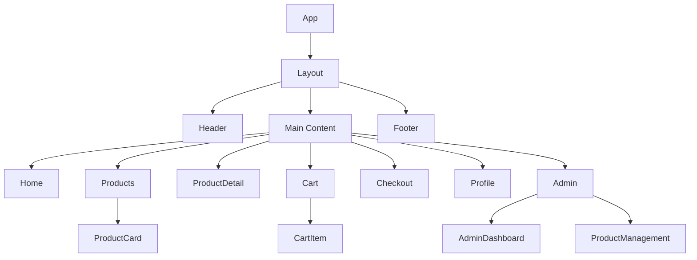
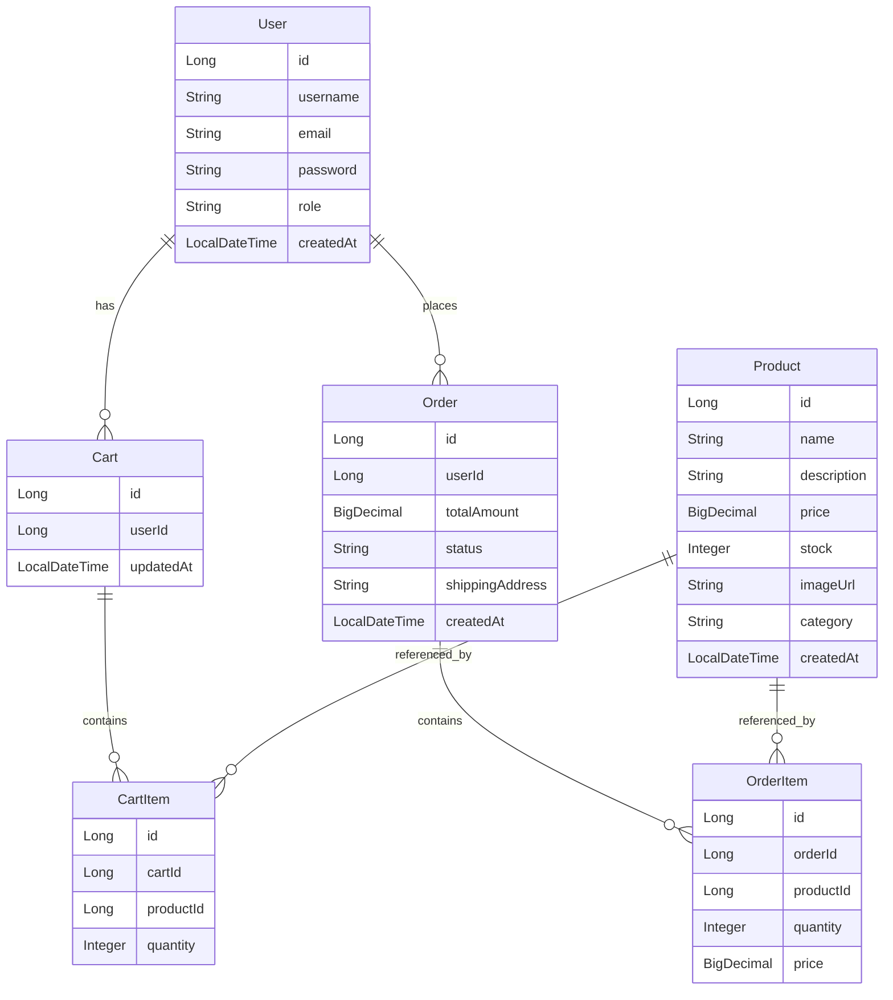
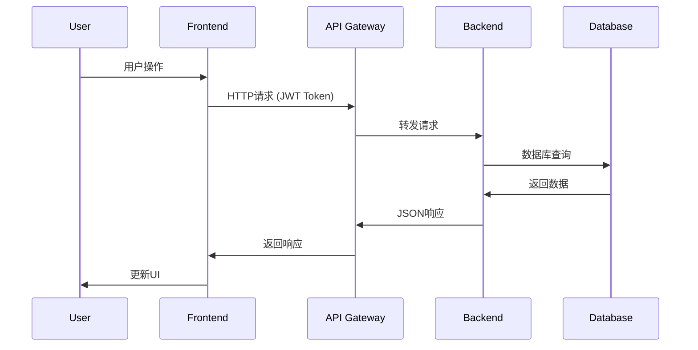
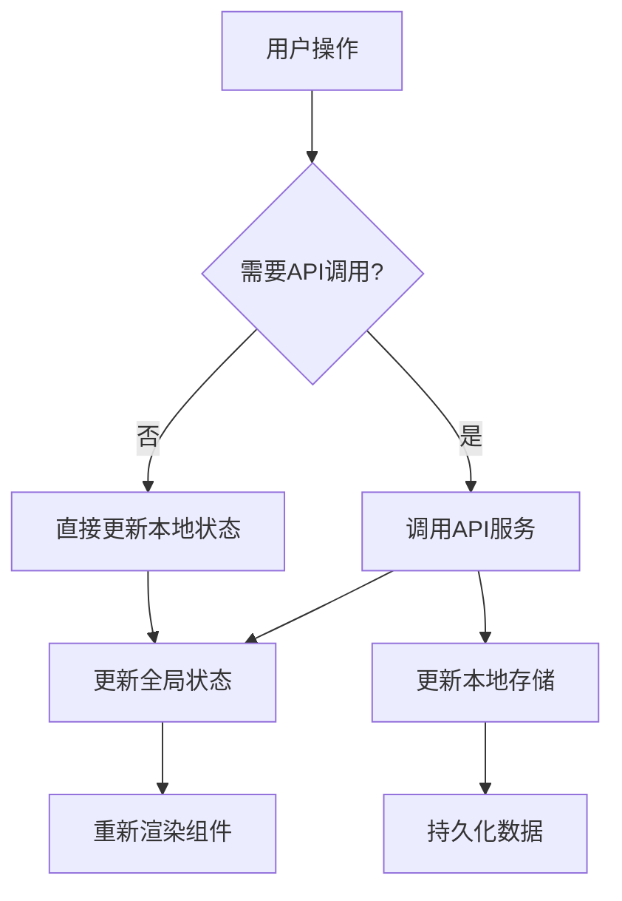
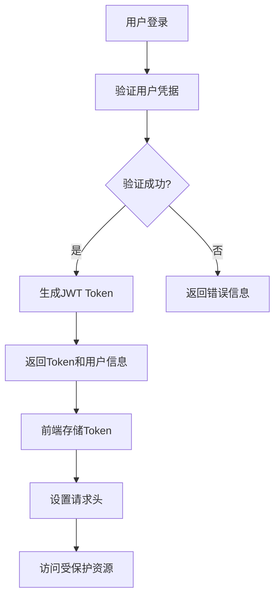
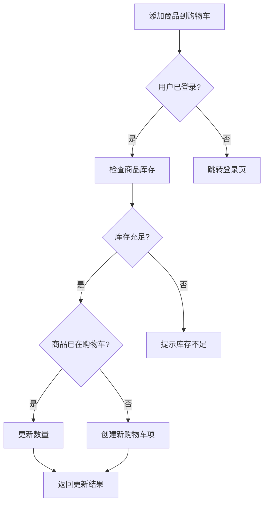
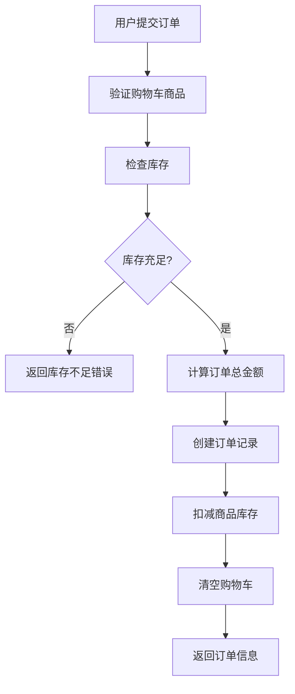

# 全栈商城项目设计文档

## 1. 项目概述

### 1.1 项目简介
FullStackMall是一个现代化的电子商务平台，采用前后端分离架构。前端使用React技术栈构建用户界面，后端采用Java Spring Boot框架提供API服务。项目目标是快速交付一个功能完整的MVP商城demo。

### 1.2 技术栈
- **前端**: React 18 + TypeScript + Vite + Tailwind CSS + React Router + Axios
- **后端**: Java 17 + Spring Boot 3.x + Spring Security + Spring Data JPA + MySQL
- **部署**: Docker + Docker Compose

### 1.3 MVP核心功能
- 用户注册/登录
- 商品浏览与搜索
- 购物车管理
- 订单处理
- 基础管理后台

## 2. 前端架构

### 2.1 项目结构
```
frontend/
├── src/
│   ├── components/        # 通用组件
│   │   ├── Layout/       # 布局组件
│   │   ├── Header/       # 头部导航
│   │   ├── Footer/       # 底部信息
│   │   ├── ProductCard/  # 商品卡片
│   │   └── Loading/      # 加载组件
│   ├── pages/            # 页面组件
│   │   ├── Home/         # 首页
│   │   ├── Products/     # 商品列表
│   │   ├── ProductDetail/# 商品详情
│   │   ├── Cart/         # 购物车
│   │   ├── Checkout/     # 结算页
│   │   ├── Profile/      # 用户中心
│   │   └── Admin/        # 管理后台
│   ├── services/         # API服务
│   ├── store/            # 状态管理
│   ├── utils/            # 工具函数
│   └── types/            # TypeScript类型定义
```

### 2.2 组件层次结构



### 2.3 状态管理
使用React Context + useReducer实现轻量级状态管理：
- **UserContext**: 用户认证状态
- **CartContext**: 购物车状态
- **ProductContext**: 商品数据缓存

### 2.4 路由设计
```javascript
// 主要路由配置
/                    # 首页
/products           # 商品列表
/products/:id       # 商品详情
/cart               # 购物车
/checkout           # 结算页
/login              # 登录
/register           # 注册
/profile            # 用户中心
/admin              # 管理后台（需要管理员权限）
```

## 3. 后端架构

### 3.1 项目结构
```
backend/
├── src/main/java/com/fullstackmall/
│   ├── config/           # 配置类
│   │   ├── SecurityConfig.java
│   │   └── WebConfig.java
│   ├── controller/       # 控制器层
│   │   ├── AuthController.java
│   │   ├── ProductController.java
│   │   ├── CartController.java
│   │   └── OrderController.java
│   ├── service/          # 服务层
│   │   ├── UserService.java
│   │   ├── ProductService.java
│   │   ├── CartService.java
│   │   └── OrderService.java
│   ├── repository/       # 数据访问层
│   │   ├── UserRepository.java
│   │   ├── ProductRepository.java
│   │   ├── CartRepository.java
│   │   └── OrderRepository.java
│   ├── entity/           # 实体类
│   │   ├── User.java
│   │   ├── Product.java
│   │   ├── Cart.java
│   │   ├── CartItem.java
│   │   └── Order.java
│   └── dto/              # 数据传输对象
```

### 3.2 数据模型设计



### 3.3 API端点设计

#### 认证相关
| 方法 | 端点 | 描述 | 请求体 | 响应 |
|-----|------|------|--------|------|
| POST | /api/auth/register | 用户注册 | {username, email, password} | {token, user} |
| POST | /api/auth/login | 用户登录 | {email, password} | {token, user} |
| POST | /api/auth/logout | 用户登出 | - | {message} |

#### 商品相关
| 方法 | 端点 | 描述 | 查询参数 | 响应 |
|-----|------|------|----------|------|
| GET | /api/products | 获取商品列表 | page, size, category, search | {products[], totalPages} |
| GET | /api/products/{id} | 获取商品详情 | - | {product} |
| POST | /api/products | 创建商品(管理员) | {name, description, price, stock} | {product} |
| PUT | /api/products/{id} | 更新商品(管理员) | {name, description, price, stock} | {product} |
| DELETE | /api/products/{id} | 删除商品(管理员) | - | {message} |

#### 购物车相关
| 方法 | 端点 | 描述 | 请求体 | 响应 |
|-----|------|------|--------|------|
| GET | /api/cart | 获取购物车 | - | {cartItems[]} |
| POST | /api/cart/items | 添加商品到购物车 | {productId, quantity} | {cartItem} |
| PUT | /api/cart/items/{id} | 更新购物车商品数量 | {quantity} | {cartItem} |
| DELETE | /api/cart/items/{id} | 删除购物车商品 | - | {message} |

#### 订单相关
| 方法 | 端点 | 描述 | 请求体 | 响应 |
|-----|------|------|--------|------|
| POST | /api/orders | 创建订单 | {shippingAddress, items[]} | {order} |
| GET | /api/orders | 获取用户订单列表 | - | {orders[]} |
| GET | /api/orders/{id} | 获取订单详情 | - | {order} |

## 4. 数据流架构

### 4.1 前后端通信流程



### 4.2 状态管理流程



## 5. 业务逻辑层

### 5.1 用户认证流程



### 5.2 购物车业务逻辑



### 5.3 订单处理流程



## 6. 中间件与拦截器

### 6.1 Spring Security配置
```java
// JWT认证过滤器
@Component
public class JwtAuthenticationFilter extends OncePerRequestFilter {
    // 验证JWT Token
    // 设置安全上下文
}

// 安全配置
@Configuration
@EnableWebSecurity
public class SecurityConfig {
    // 配置HTTP安全
    // 配置JWT过滤器
    // 配置CORS
}
```

### 6.2 前端请求拦截器
```javascript
// Axios请求拦截器
axios.interceptors.request.use(
  (config) => {
    // 添加认证头
    const token = localStorage.getItem('token');
    if (token) {
      config.headers.Authorization = `Bearer ${token}`;
    }
    return config;
  }
);

// 响应拦截器
axios.interceptors.response.use(
  (response) => response,
  (error) => {
    // 处理认证错误
    if (error.response?.status === 401) {
      // 清除token，跳转登录
    }
    return Promise.reject(error);
  }
);
```

## 7. 测试策略

### 7.1 前端测试
- **单元测试**: Jest + React Testing Library
  - 组件渲染测试
  - 用户交互测试
  - 状态管理测试
- **集成测试**: Cypress
  - 端到端用户流程测试
  - API集成测试

### 7.2 后端测试
- **单元测试**: JUnit 5 + Mockito
  - Service层业务逻辑测试
  - Repository层数据访问测试
- **集成测试**: Spring Boot Test
  - Controller层API测试
  - 数据库集成测试
- **API测试**: Postman/Newman
  - 接口功能测试
  - 性能测试