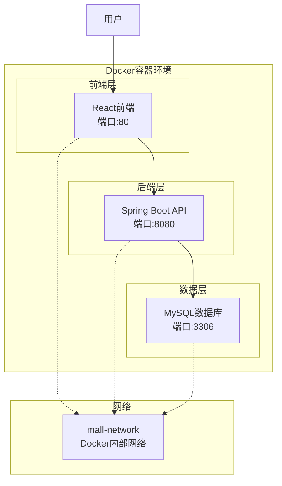
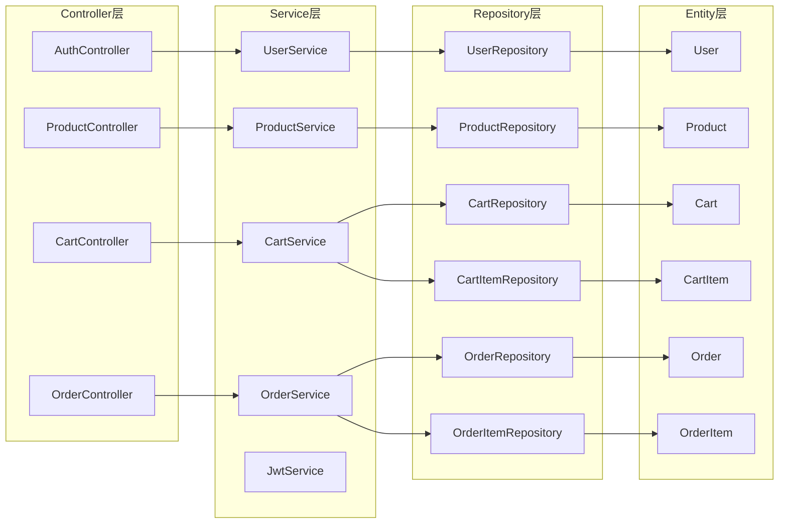
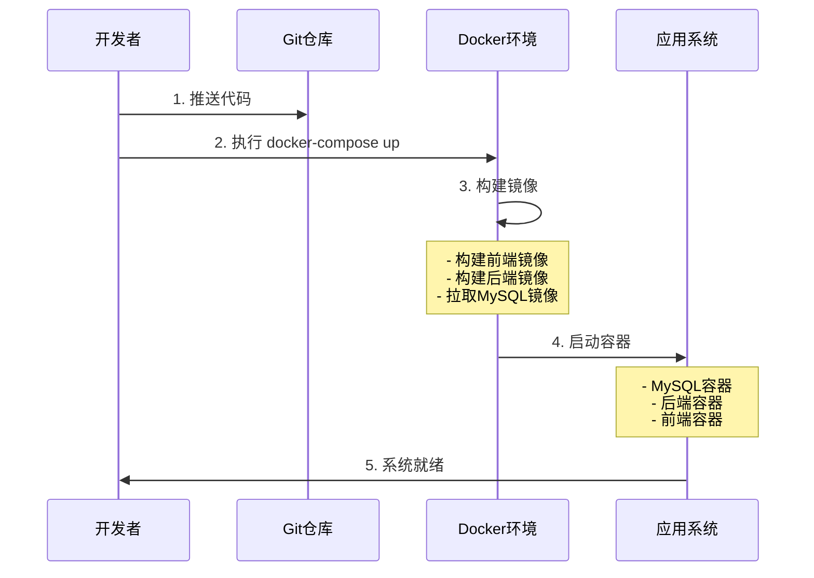
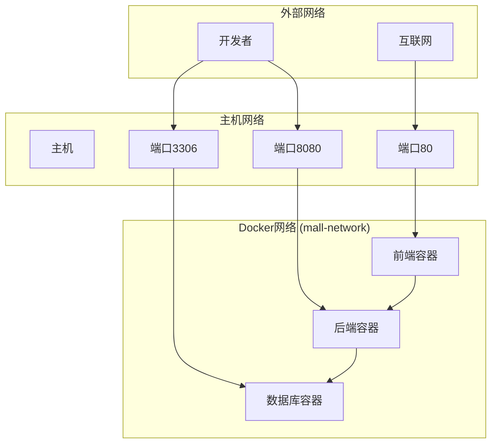
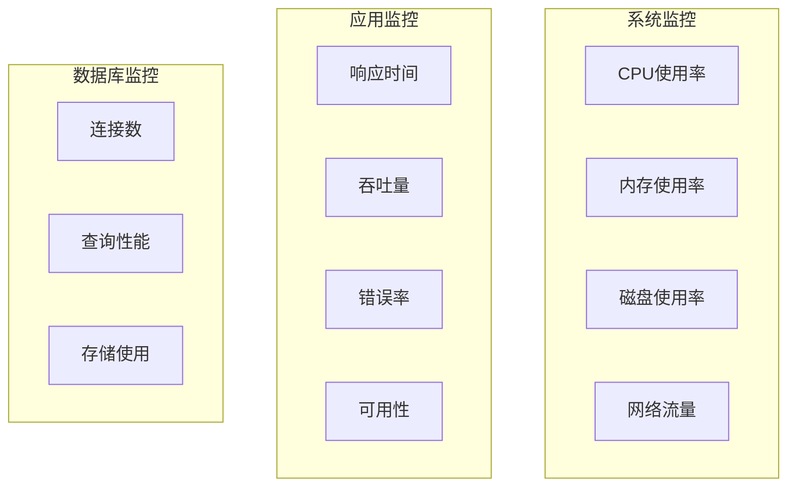
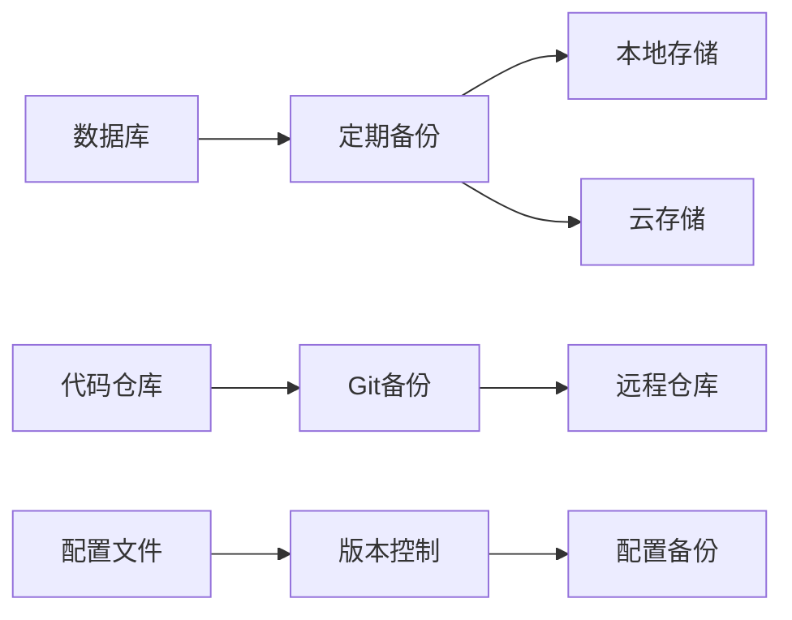
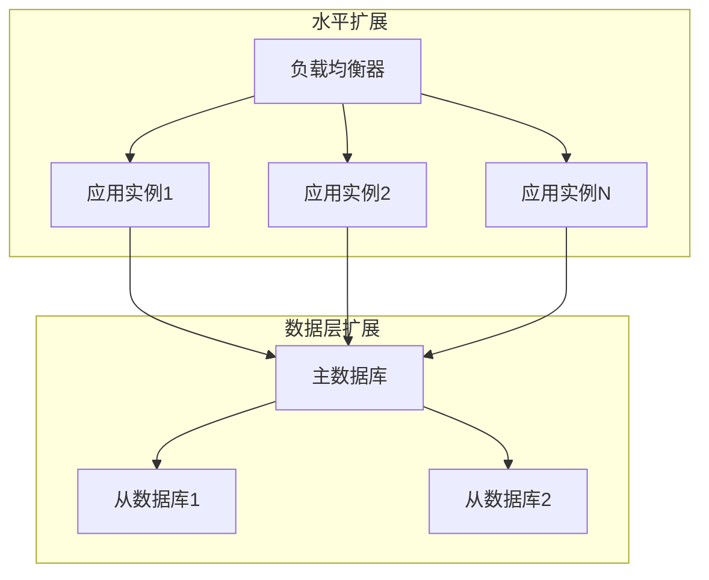
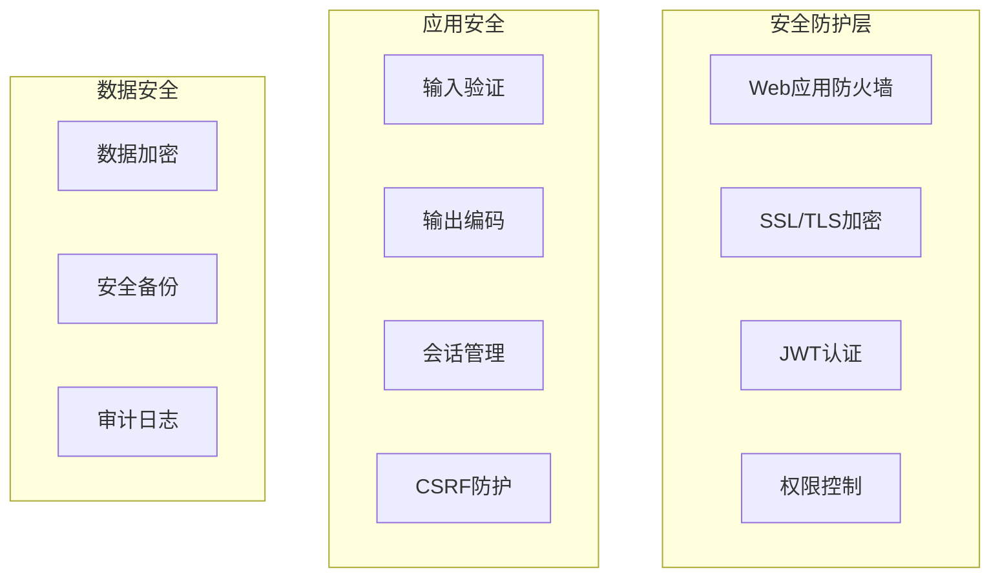

# FullStackMall 项目管理与快速部署设计文档

## 概述

FullStackMall是一个前后端分离的全栈电商平台，采用React + Spring Boot技术栈，通过Docker容器化部署实现快速启动和统一管理。项目旨在提供完整的电商功能，包括用户认证、商品管理、购物车和订单处理等核心业务。

### 核心特性
- **前后端分离架构**：前端React + 后端Spring Boot
- **容器化部署**：Docker Compose统一编排
- **统一开发环境**：标准化的开发和部署流程
- **快速启动**：一键部署整个系统

## 技术架构

### 系统架构图



### 技术栈组成

| 层级 | 技术选型 | 版本 | 说明 |
|------|----------|------|------|
| 前端 | React | 18+ | 用户界面框架 |
| 前端构建 | Vite | 最新 | 开发构建工具 |
| 前端样式 | Tailwind CSS | 最新 | CSS框架 |
| 后端 | Spring Boot | 3.2.0 | Java应用框架 |
| 数据库 | MySQL | 8.0 | 关系型数据库 |
| 认证 | JWT + Spring Security | 最新 | 身份认证与授权 |
| 容器化 | Docker + Docker Compose | 最新 | 容器编排 |
| API文档 | Swagger/OpenAPI | 2.2.0 | API文档生成 |

## 项目结构管理

### 目录架构

```
FullStackMall/
├── frontend/                    # React前端项目
│   ├── src/
│   ├── public/
│   ├── package.json
│   ├── vite.config.js
│   └── Dockerfile
├── backend/                     # Spring Boot后端项目
│   ├── src/main/
│   │   ├── java/com/fullstackmall/
│   │   │   ├── controller/      # API控制器
│   │   │   ├── dto/            # 数据传输对象
│   │   │   ├── entity/         # JPA实体类
│   │   │   ├── repository/     # 数据访问层
│   │   │   ├── service/        # 业务逻辑层
│   │   │   └── FullStackMallApplication.java
│   │   └── resources/
│   │       └── application.yml
│   ├── pom.xml
│   └── Dockerfile
├── docker-compose.yml          # 容器编排配置
├── .gitignore                  # Git忽略文件
└── README.md                   # 项目说明文档
```

### 核心模块说明

#### 后端模块架构



## 快速部署方案

### 部署流程



### 容器编排配置

#### Docker Compose服务定义

| 服务名 | 镜像 | 端口映射 | 依赖关系 | 说明 |
|--------|------|----------|----------|------|
| mysql | mysql:8.0 | 3306:3306 | - | 数据库服务 |
| backend | 自构建 | 8080:8080 | mysql | 后端API服务 |
| frontend | 自构建 | 80:80 | backend | 前端Web服务 |

#### 环境变量配置

```yaml
# MySQL配置
MYSQL_ROOT_PASSWORD: rootpassword
MYSQL_DATABASE: fullstackmall
MYSQL_USER: mall_user
MYSQL_PASSWORD: mall_password

# Spring Boot配置
SPRING_DATASOURCE_URL: jdbc:mysql://mysql:3306/fullstackmall
SPRING_DATASOURCE_USERNAME: mall_user
SPRING_DATASOURCE_PASSWORD: mall_password
```

### 网络架构



## 开发与部署命令

### 快速启动命令

```bash
# 一键启动整个系统
docker-compose up -d

# 查看服务状态
docker-compose ps

# 查看日志
docker-compose logs -f [service_name]

# 停止服务
docker-compose down
```

### 开发模式命令

```bash
# 后端开发启动
cd backend
mvn spring-boot:run

# 前端开发启动（需要前端项目完整实现后）
cd frontend
npm install
npm run dev
```

### 构建命令

```bash
# 重新构建镜像
docker-compose build

# 强制重新构建
docker-compose build --no-cache

# 构建并启动
docker-compose up --build
```

## 数据管理策略

### 数据持久化

```mermaid
graph LR
    subgraph "Docker Volume"
        MysqlData[mysql_data卷]
    end
    
    subgraph "MySQL容器"
        DataDir[/var/lib/mysql]
    end
    
    subgraph "主机"
        HostData[主机存储]
    end
    
    MysqlData --> DataDir
    HostData --> MysqlData
```

### 数据库连接配置

| 配置项 | 值 | 说明 |
|--------|-----|------|
| 数据库名 | fullstackmall | 主业务数据库 |
| 用户名 | mall_user | 应用连接用户 |
| 密码 | mall_password | 应用连接密码 |
| 连接URL | jdbc:mysql://mysql:3306/fullstackmall | 容器内连接地址 |

## 项目管理规范

### Git忽略规则

```gitignore
# 设计文档目录
.qoder/

# 编译输出
target/
build/
dist/

# 依赖目录
node_modules/

# 环境配置
.env
.env.local

# IDE文件
.vscode/
.idea/
*.iml

# 日志文件
*.log

# 数据库文件
*.db
*.sqlite

# 系统文件
.DS_Store
Thumbs.db
```

### 开发流程


### 版本控制策略

| 分支类型 | 命名规则 | 用途 |
|----------|----------|------|
| 主分支 | main | 生产环境代码 |
| 开发分支 | develop | 开发环境集成 |
| 功能分支 | feature/* | 新功能开发 |
| 修复分支 | hotfix/* | 紧急问题修复 |

## 监控与运维

### 服务监控指标



### 日志管理

| 组件 | 日志位置 | 日志级别 |
|------|----------|----------|
| Spring Boot | 容器标准输出 | INFO |
| MySQL | 容器标准输出 | WARN |
| Nginx | 容器标准输出 | ERROR |

### 备份策略



## 性能优化建议

### 系统性能优化

1. **数据库优化**
   - 添加适当索引
   - 优化查询语句
   - 配置连接池

2. **应用层优化**
   - 启用缓存机制
   - 异步处理长时间任务
   - 优化API响应时间

3. **前端优化**
   - 代码分割和懒加载
   - 静态资源CDN
   - 浏览器缓存策略

### 扩展性考虑



## 安全措施

### 安全架构



### 安全配置检查清单

| 安全项 | 状态 | 说明 |
|--------|------|------|
| JWT密钥配置 | ✅ | 使用强密钥 |
| 数据库密码 | ✅ | 复杂密码 |
| HTTPS配置 | ⏳ | 生产环境需要 |
| 输入验证 | ✅ | Bean Validation |
| SQL注入防护 | ✅ | JPA防护 |
| XSS防护 | ⏳ | 前端需要实现 |

## 测试策略

### 测试金字塔


### 测试环境

| 环境类型 | 用途 | 数据 |
|----------|------|------|
| 开发环境 | 日常开发 | 模拟数据 |
| 测试环境 | 功能测试 | 测试数据集 |
| 预生产环境 | 发布验证 | 生产数据副本 |
| 生产环境 | 正式运行 | 真实数据 |